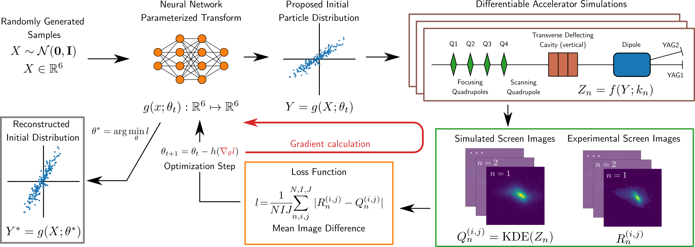

Generative Phase Space Reconstruction (GPSR)
====

Flexible reconstruction of beam distributions from experimental measurements.

The goal of this package is to provide software necessary to reconstruct
phase space distributions from experimental data. This work is based on
the following publications:

[Phase Space Reconstruction from Accelerator Beam Measurements Using Neural Networks and Differentiable Simulations](https://journals.aps.org/prl/abstract/10.1103/PhysRevLett.130.145001)

[Efficient six-dimensional phase space reconstructions from experimental measurements using generative machine learning](https://journals.aps.org/prab/abstract/10.1103/PhysRevAccelBeams.27.094601)

<div align="center">
  
</div>

## Installation
Using `pip`

```shell
git clone https://github.com/roussel-ryan/gpsr.git
cd gpsr
pip install -e .
```
or for development,

```shell
pip install -e ".[dev]"
```
